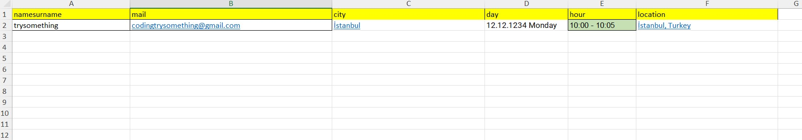
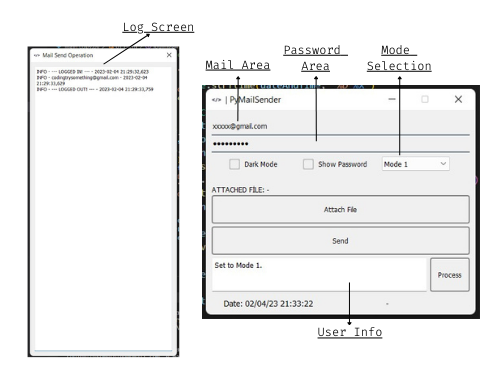

<p align="center">
	
</p>
<br>

# <p align="center">PyMailSender v1


<p align="center">
<a href="https://github.com/mucahitbektas"></a>
 <a href="https://github.com/mucahitbektas/PyMailSender"></a>
</a>
</p>

<p align="center">
	
</p>

# PyMail Sender Application
A python-encoded mail sending application using the SMTP module. The interface was prepared using Pyqt5. 

In the application, an interview invitation mail message was used as an example. In the mail, name, surname, day, time and location are used as formattable. The data is received and processed via the excel file and e-mail is sent. An example excel file is given below.

<br>

<p align="center">
	
</p>

<br>

# Multi-Mail-Sender

```
1- Enter the values in the mail and password field(This password must be the application password)

2- Set the mail mode you will send

3- Click 'Attach File' button and fix the excel file you prepared before

4- Click the 'Send' button. Log screen will open and records of sent mails will be displayed on this screen. 

5- When all mails are sent, a log file named 'sended<file name>' will be created in the directory where the excel file is located. You can check the emails sent with this file.

```

# How to get application password?
> You can obtain your e-mail password, which is required for the use of the application, by following the steps in the link given below.

> https://support.google.com/mail/answer/185833?hl=en


<br>
<p align="center">
	
</p>

<br>

# Contact with me:
<p align="center">
<a href="mailto:m.bektastr@gmail.com">
</a>  
<a href="https://www.linkedin.com/in/mucahitbektas/"></a>  
<a  href="https://www.instagram.com/mucahitbektas_/"> </a>
 <a  href="https://www.mucahitbektas.com/"></a>
 </p>